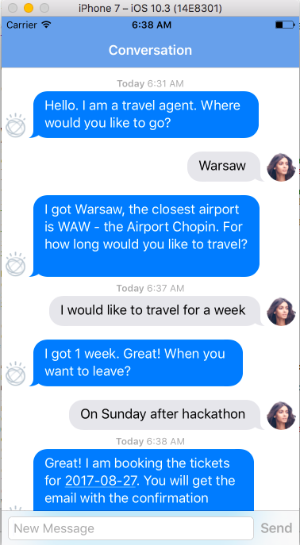

# 2017-IATA-hack-sv
This is a repo for IATA Hack in Silicon Valley in 2017. If you use it please give me a star - thank you!



The chatbot created with IBM Watson Conversation service and Web & Mobile project in 30 minutes.

In order to create the chatbot with IBM technologies you need to do the following steps:

- sign up for [http://bluemix.net](bluemix.net)
- then you can use the [Web and Mobile wizard](https://console.bluemix.net/developer/getting-started/?env_id=ibm:yp:us-south)
- after creating the chatbot example on Bluemix, you can download the code and follow the readme file (cocoapod, and carthage installs)
- finally you can leverage the json with the example dialog (entities, intents, dialog) by importing it - feel free to use the provided [IATA_hackathon_2017SV_travel_chatbot.json](IATA_hackathon_2017SV_travel_chatbot.json) - that was developed during the webcast!
- then you need to bind the conversation workspace id with the code

```swift
let conversationWorkspaceID = "ed4a90de-4705-4dd1-b79d-c5ad1d129430" //add the workspace ID from Dialog at the Conversation Service.
//Workspace ID for Dialog needs to come from the IBM Conversation service - check its dashboard for details 

```

Follow me on twitter: @blumareks and my blog blumareks.blogspot.com
